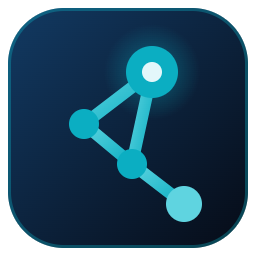
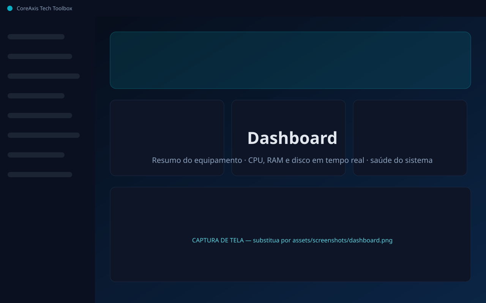
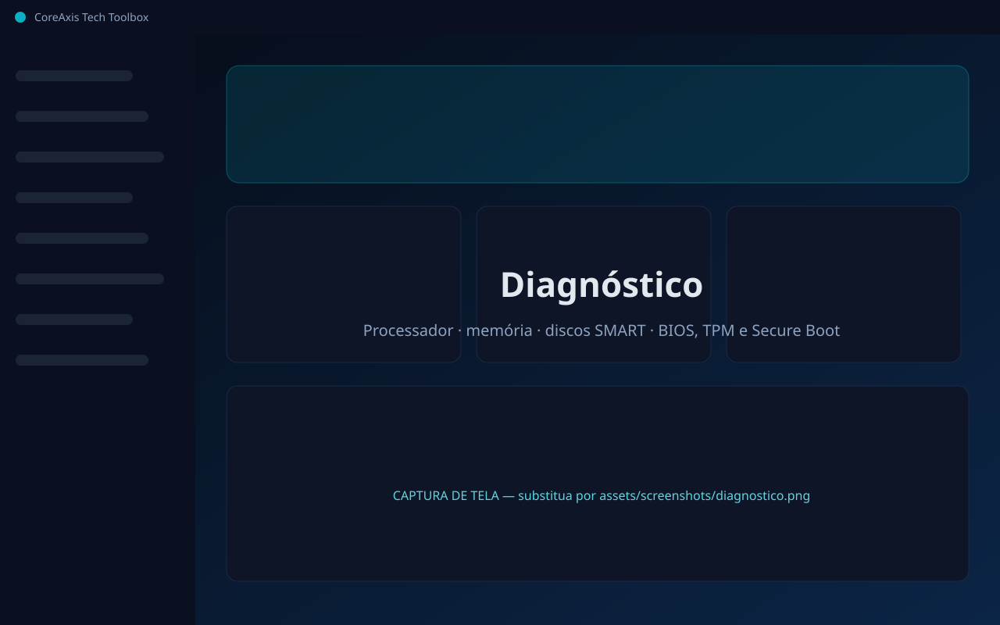
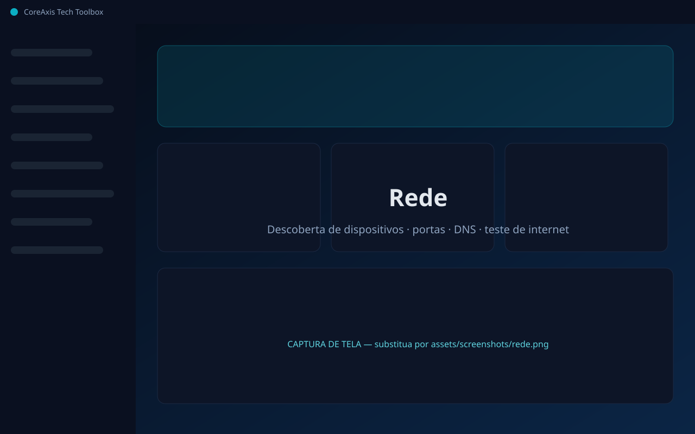

<div align="center">



# CoreAxis Tech Toolbox

**A caixa de ferramentas portátil do técnico de TI para Windows 10 e 11.**
Diagnóstico, rede, reparo, segurança, automação, inventário e atendimento — em um único executável, sem instalação.

[](https://github.com/georgeangra/coreaxis-tech-toolbox/releases/latest)
[](#requisitos)
[](#-como-verificar-a-autenticidade-do-download)
[](https://github.com/georgeangra/coreaxis-tech-toolbox/actions/workflows/verify-release.yml)
[](PRIVACIDADE.md)

[**⬇ Baixar**](https://github.com/georgeangra/coreaxis-tech-toolbox/releases/latest) ·
[Site oficial](https://georgeangra.github.io/coreaxis-tech-toolbox/) ·
[Verificar download](https://georgeangra.github.io/coreaxis-tech-toolbox/verificar.html) ·
[Changelog](CHANGELOG.md) ·
[Segurança](SECURITY.md)

</div>

---

## Sumário

- [O que é](#o-que-é)
- [Funcionalidades](#funcionalidades)
- [Benefícios](#benefícios)
- [Capturas de tela](#capturas-de-tela)
- [Requisitos](#requisitos)
- [Instalação](#instalação)
- [Como verificar a autenticidade do download](#-como-verificar-a-autenticidade-do-download)
- [Uso](#uso)
- [Licenciamento](#licenciamento)
- [Privacidade e transparência](#privacidade-e-transparência)
- [Perguntas frequentes](#perguntas-frequentes)
- [Suporte e contato](#suporte-e-contato)
- [Desenvolvedor](#desenvolvedor)

---

## O que é

O **CoreAxis Tech Toolbox** é uma suíte profissional para técnicos de suporte, assistências técnicas e equipes de TI. Ele reúne em um só programa as ferramentas que normalmente ficam espalhadas entre utilitários gratuitos, planilhas e sistemas de chamados — e funciona **direto do pendrive**, sem instalar nada no computador do cliente.

Os dados de clientes, equipamentos e chamados ficam **criptografados (AES-256)** no próprio pendrive. Nada é enviado para servidores.

## Funcionalidades

| Módulo | O que faz |
|---|---|
| 📊 **Dashboard** | Resumo do equipamento, CPU/RAM/disco em tempo real, saúde do sistema (antivírus, firewall, reinicialização pendente, espaço em disco), ações rápidas e chamados abertos |
| 🧩 **Diagnóstico** | Processador, memória (módulos e slots livres), discos (SMART, desgaste, temperatura), BIOS/UEFI, Secure Boot, TPM, placa-mãe, vídeo, monitores, rede e bateria · exporta PDF |
| 🌐 **Rede** | Ping, Traceroute, PathPing, NSLookup, scanner de portas, **descoberta automática de dispositivos** (fabricante pelo MAC, tipo provável, serviços), teste de DNS comparativo e teste de internet (latência, download, upload) |
| 🛠️ **Windows** | SFC, DISM, rotina completa de reparo, limpeza de temporários com análise prévia, cache DNS, reset de rede, Windows Update (buscar, instalar, reparar), drivers (problemas, backup, restauração) e 32 atalhos de ferramentas nativas |
| 🛡️ **Segurança** | Windows Defender (status, ameaças, verificações), firewall por perfil, 25 serviços críticos, processos com verificação de assinatura digital |
| ⚙️ **Automação** | Biblioteca com 19 scripts PowerShell prontos (spooler, ativação, SMART, eventos críticos, ponto de restauração, NTP…) e criação de scripts próprios |
| 📋 **Inventário** | Coleta completa de hardware e softwares, histórico, vínculo com cliente/equipamento, relatórios **PDF** e **Excel** |
| 🎧 **Atendimento** | Clientes, equipamentos, histórico de manutenção com custos, chamados com prioridade e **Ordem de Serviço em PDF** com a sua marca |

## Benefícios

- **Portátil de verdade** — um único `.exe`; não instala nada e, com licença, não deixa rastros no PC do cliente.
- **Tudo em um** — diagnóstico, reparo e gestão do atendimento no mesmo lugar.
- **Funciona offline** — a internet só é usada nos testes de rede que você aciona e para verificar atualizações (desativável).
- **Dados protegidos** — cofre criptografado AES-256-GCM, login por técnico, bloqueio automático e trilha de auditoria. Útil para a conformidade com a LGPD.
- **Aparência profissional para o seu cliente** — relatórios e Ordens de Serviço com o seu logo.
- **Feito para o Brasil** — interface em português, CPF/CNPJ, R$, laudo técnico, NTP.br.
- **Integridade verificável** — cada release publica o SHA-256 oficial; os scripts PowerShell estão abertos para auditoria.

## Capturas de tela

> As imagens abaixo são marcadores de posição. Substitua pelos arquivos reais em `assets/screenshots/` mantendo os mesmos nomes.

| | |
|---|---|
|  |  |
|  |  |

## Requisitos

- Windows 10 (1809+) ou Windows 11, 64 bits
- Permissão de administrador (o programa solicita ao abrir — necessária para SFC, DISM, drivers e SMART)
- ~110 MB livres no pendrive ou na pasta escolhida
- Nenhuma dependência adicional (.NET, Visual C++, Node etc.)

## Instalação

O programa **não é instalado**. Basta:

1. Baixe `CoreAxisTechToolbox-<versão>-portable.exe` em **[Releases](https://github.com/georgeangra/coreaxis-tech-toolbox/releases/latest)** — use **somente** este endereço oficial.
2. **[Verifique o SHA-256](#-como-verificar-a-autenticidade-do-download)** do arquivo.
3. Crie uma pasta exclusiva (ex.: `E:\CoreAxis` no pendrive ou `C:\CoreAxis`) e coloque o `.exe` dentro.
4. Dê dois cliques. Aceite o pedido de administrador (UAC).

> **"O Windows protegeu o computador"?** Enquanto o executável não possui assinatura digital Authenticode, o SmartScreen pode exibir esse aviso. Confirme o SHA-256 e clique em *Mais informações → Executar assim mesmo*. A assinatura digital está planejada (ver [SECURITY.md](SECURITY.md#assinatura-digital)).

Os dados ficam na pasta `CoreAxisData`, criada ao lado do `.exe`. Para levar tudo para outro pendrive, copie o `.exe` **junto** com essa pasta.

## 🔐 Como verificar a autenticidade do download

Cada versão publica o hash **SHA-256** oficial no arquivo [`SHA256.txt`](SHA256.txt), na página da release e no [site](https://georgeangra.github.io/coreaxis-tech-toolbox/verificar.html). Se o hash do arquivo baixado for diferente, **não execute** — o arquivo foi corrompido ou alterado.

**PowerShell (Windows):**

```powershell
Get-FileHash .\CoreAxisTechToolbox-1.1.1-portable.exe -Algorithm SHA256
```

Compare o campo `Hash` com o valor oficial:

```text
C9E440F7EC0A8166236663701A2822AB35E42014C6BF2FBC5A2C30085C7A103F
```

**Prompt de Comando (cmd):**

```bat
certutil -hashfile CoreAxisTechToolbox-1.1.1-portable.exe SHA256
```

**Linux / macOS / Git Bash** (com o `SHA256.txt` da release na mesma pasta):

```bash
sha256sum -c SHA256.txt
```

**Sem comandos:** abra a página [Verificar download](https://georgeangra.github.io/coreaxis-tech-toolbox/verificar.html) e arraste o arquivo — o hash é calculado **no seu navegador**, sem enviar o arquivo para lugar nenhum.

Além do SHA-256, o próprio programa verifica a sua integridade ao abrir (pacote interno protegido e scripts conferidos por hash) e recusa atualizações sem a assinatura digital oficial.

## Uso

1. **Primeiro acesso:** aceite o contrato de uso, crie o usuário **administrador** e anote a **chave de recuperação** (exibida uma única vez, guarde fora do pendrive).
2. **Teste grátis:** 15 dias com todas as funções.
3. **Dia a dia:** abra o programa, faça login e use os módulos pela barra lateral. Atalhos: `Ctrl+1…9` alterna módulos, `F5` atualiza, `Ctrl+L` bloqueia.
4. **Equipe:** em *Configurações → Usuários e segurança*, crie contas para cada técnico (perfil Técnico ou Administrador).
5. **Ao terminar:** feche o programa e use "Ejetar" antes de remover o pendrive.

Manual completo: [docs/MANUAL_UTILIZACAO.md](docs/MANUAL_UTILIZACAO.md).

## Licenciamento

O CoreAxis Tech Toolbox é um **software comercial**: o download é gratuito, o uso depois do teste exige licença paga. Cada licença vale para **um dispositivo** — um pendrive (funciona em qualquer PC, rodando a partir dele) ou um computador. Copiar o programa para outro pendrive ou PC não leva a licença junto.

O teste de 15 dias é **um por dispositivo**: baixar de novo, apagar a pasta `CoreAxisData`, trocar o programa de pasta ou atrasar o relógio não reinicia o teste.

1. Use os 15 dias de teste.
2. Em *Configurações → Licença*, copie o **código do dispositivo** e envie para a CoreAxis Tech.
3. Ative o arquivo `.lic` recebido. A ativação é **offline**.

Licença vencida ou teste encerrado: o programa entra em **modo consulta** — seus dados continuam acessíveis e exportáveis. **Você nunca perde seus dados.**

Termos completos: [LICENSE](LICENSE).

## Privacidade e transparência

- ✅ **Não coleta informações pessoais.** Não há telemetria, rastreamento, analytics nem cadastro online.
- ✅ **Não envia dados para terceiros.** Clientes, chamados e inventários ficam somente no seu dispositivo, criptografados.
- ✅ **Pode ser validado por hash SHA-256** em cada versão publicada.
- ✅ **É distribuído exclusivamente pelo GitHub** ([Releases](https://github.com/georgeangra/coreaxis-tech-toolbox/releases)).
- ✅ **Código auditável sempre que aplicável:** os scripts PowerShell que o programa executa com privilégios de administrador estão publicados em [`auditoria/`](auditoria/), com o manifesto de hashes de cada versão.

O programa só se conecta à internet nos testes de rede/velocidade que **você** aciona (Cloudflare, Google, ipify, servidores DNS públicos) e para verificar atualizações no GitHub (ao iniciar, desativável, ou quando você clica). Nenhum dado seu é enviado. Detalhes em [PRIVACIDADE.md](PRIVACIDADE.md).

## Perguntas frequentes

<details>
<summary><b>Precisa instalar alguma coisa?</b></summary>
Não. O programa é um único executável portátil. Ele não altera o registro de instalação do Windows e não aparece em "Programas e Recursos".
</details>

<details>
<summary><b>Por que ele pede permissão de administrador?</b></summary>
Funções como SFC, DISM, reset de rede, drivers, SMART, TPM e Secure Boot exigem privilégios elevados no Windows. Todos os scripts executados estão publicados em <a href="auditoria/">auditoria/</a> para conferência.
</details>

<details>
<summary><b>O antivírus ou o SmartScreen alertou. É seguro?</b></summary>
Executáveis portáteis sem assinatura digital costumam gerar falso positivo. Confira o SHA-256 com o valor oficial antes de executar. Se o hash conferir, o arquivo é o original. Alertas reais de malware devem ser relatados conforme o <a href="SECURITY.md">SECURITY.md</a>.
</details>

<details>
<summary><b>Meus dados são enviados para algum servidor?</b></summary>
Não. Todos os dados ficam no seu pendrive/PC, dentro de um cofre criptografado com AES-256. A CoreAxis Tech não tem acesso a eles.
</details>

<details>
<summary><b>Esqueci a senha. E agora?</b></summary>
Técnicos: peça ao administrador para redefinir. Administrador: use "Esqueci a senha do administrador" na tela de login e informe a chave de recuperação. Sem senha e sem chave de recuperação, os dados não podem ser recuperados por ninguém — é isso que garante a proteção.
</details>

<details>
<summary><b>Funciona sem internet?</b></summary>
Sim. A internet só é usada nos testes de rede/velocidade e na busca de atualizações. A ativação da licença também é offline.
</details>

<details>
<summary><b>O pendrive queimou. Perdi a licença?</b></summary>
Não. A licença admite uma transferência gratuita por ano. Envie o código do novo dispositivo e restaure a pasta <code>CoreAxisData</code> de um backup (Configurações → Dados → Fazer backup agora).
</details>

<details>
<summary><b>O que acontece quando a licença vence?</b></summary>
O programa entra em modo consulta: você continua vendo e exportando clientes, chamados e inventários. As ferramentas voltam após a renovação.
</details>

<details>
<summary><b>O código-fonte é aberto?</b></summary>
O núcleo do aplicativo é proprietário. Os scripts PowerShell — a parte que executa ações no seu sistema — são publicados para auditoria em <a href="auditoria/">auditoria/</a>, com os hashes conferidos pelo próprio programa.
</details>

## Suporte e contato

- 🐞 **Problemas:** [abrir um Bug Report](https://github.com/georgeangra/coreaxis-tech-toolbox/issues/new?template=bug_report.yml)
- 💡 **Sugestões:** [abrir um Feature Request](https://github.com/georgeangra/coreaxis-tech-toolbox/issues/new?template=feature_request.yml)
- 🔒 **Vulnerabilidades:** **não** abra issue pública — use o [relato privado de segurança](https://github.com/georgeangra/coreaxis-tech-toolbox/security/advisories/new) (ver [SECURITY.md](SECURITY.md))
- 💼 **Licenças comerciais:** pelo [site oficial](https://georgeangra.github.io/coreaxis-tech-toolbox/contato.html)

## Desenvolvedor

**CoreAxis Tech** — Soluções em suporte técnico e automação de TI
Desenvolvedor: **George**

<sub>© 2026 CoreAxis Tech. Todos os direitos reservados. Windows é marca registrada da Microsoft Corporation; este projeto não é afiliado à Microsoft.</sub>
